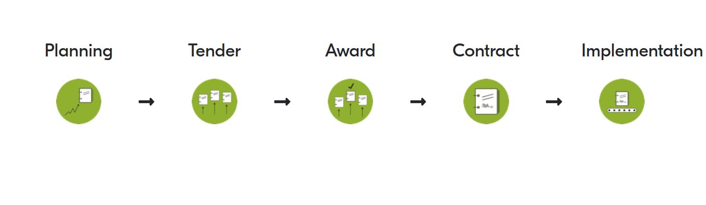

Export a report
===============

To export a report to Google Drive, click the report's document icon on the homepage.

The exported *document* is built from *templates* in Google Docs.

*Tags* are added to templates to generate content within the document.

Tag syntax
----------

A tag starts and ends like:

.. code-block:: none

   

A tag contains *tokens* delimited by spaces. For example:

.. code-block:: none

   

The first token is the tag's *name* (``field``). The rest are the tag's *arguments* (``path:|ocid|``, etc.).

An argument is composed of a *name*, followed by a colon, followed by its *value* between vertical bars:

.. code-block:: none

   name:|value|

-  Each tag accepts different arguments.
-  Arguments can be provided in any order.
-  An argument can be required or optional.
-  An argument name must not be repeated.

Tag types
---------

There are two types of tags:

Template tag
  This type of tag renders a template and inserts it into the document. Each template tag has access to different sub-tags.
Leaf tag
  This type of tag renders data from Pelican backend into the document. The new content inherits the styles applied to the tag.

Tag library
-----------

base template tag
~~~~~~~~~~~~~~~~~

When exporting a report, you provide the file ID for the base template.

The ``base`` tag is not available within templates. It has the other template tags as sub-tags.

overview template tag
^^^^^^^^^^^^^^^^^^^^^

This template tag renders a template with metadata about the dataset.

.. code-block:: none

   

.. list-table::
   :header-rows: 1

   * - Argument
     - Value
     - Required
     - How to determine the value
   * - ``template``
     - The Google Docs ID of the overview template
     -
     - The machine-readable path component in the Google Docs URL

The ``overview`` template tag has leaf tags as sub-tags.

lifecycleImage
''''''''''''''

Renders this image in a frame with the number of objects per contracting stage.

.. code-block:: none

   

lifecycleObjectCount
''''''''''''''''''''

Renders the number of objects for the specified contracting ``stage``.

.. code-block:: none

   

.. list-table::
   :header-rows: 1

   * - Argument
     - Value
     - Required
   * - ``stage``
     - One of planning, tender, award, contract, implementation
     - ✔️

Simple leaf tags
''''''''''''''''

Simple tags accept no arguments.

.. list-table::
   :header-rows: 1

   * - Tag
     - Description
   * - ````
     - The ID of the dataset
   * - ````
     - The ID of the dataset's ancestor, for time-based checks
   * - ````
     - The name of the dataset's publisher
   * - ````
     - The OCID prefix of the dataset
   * - ````
     - The data license of the dataset
   * - ````
     - The number of compiled releases in the dataset

Date leaf tags
''''''''''''''

Date tags accept an optional ``mode`` argument, to format the date like:

``datetime`` (default)
  2001-02-03 04:05:06
``date``
  2001-02-03
``time``
  04:05:06

.. list-table::
   :header-rows: 1

   * - Tag
     - Description
   * - ````
     - The earliest ``date`` among compiled releases
   * - ````
     - The latest ``date`` among compiled releases
   * - ````
     - The time at which Pelican backend started processing
   * - ````
     - The time at which Pelican backend finished processing
   * - ````
     - The time at which Kingfisher Collect started the collection
   * - ````
     - The time at which Kingfisher Process ended the compilation

field template tag
^^^^^^^^^^^^^^^^^^

This template tag renders a template for the specified field-level check.

.. code-block:: none

   {% field path:|tender.documents.format| template:|...| }

.. list-table::
   :header-rows: 1

   * - Argument
     - Value
     - Required
     - How to determine the value
   * - ``path``
     - The path to the field
     - ✔️
     - The value in the "field path" column of the field-level checks table
   * - ``template``
     - The Google Docs ID of the field-level check template
     -
     - The machine-readable path component in the Google Docs URL

The ``field`` template tag has leaf tags as sub-tags.

All sub-tags except ``path`` require a ``level`` argument, which must be one of:

-  ``coverage`` (unavailable for ``name`` and ``description``)
-  ``coverageSet``
-  ``coverageEmpty``
-  ``quality``

path
''''

Renders the path to the field, like ``tender.documents.format``.

.. code-block:: none

   

name
''''

Renders the name of the field-level check, indicated by the ``level`` argument.

For example, if a ``field`` template tag sets ``path:|tender.documents.format|``:

.. code-block:: none

   

will render:

   Document format is recognized

description
'''''''''''

Renders the description of the field-level check, indicated by the ``level`` argument.

For example, if a ``field`` template tag sets ``path:|tender.documents.format|``:

.. code-block:: none

   

will render:

   The value is a string and is either an IANA Media Type or the 'offline/print' code. (The codelist is open.)

resultBoxImage
''''''''''''''

Renders an image describing the pass/fail rate of the test indicated by the ``level`` argument.

.. code-block:: none

   

Count leaf tags
'''''''''''''''

Renders a number relating to the test corresponding to the ``level`` argument.

.. list-table::
   :header-rows: 1

   * - Tag
     - Description
   * - ````
     - The number of times the test ran
   * - ````
     - The number of times the test passed
   * - ````
     - The number of times the test failed

Sample leaf tags
''''''''''''''''

Renders a sample list of OCIDs that passed (or failed) the test indicated by the ``level`` argument.

.. code-block:: none

   

.. code-block:: none

   

.. list-table::
   :header-rows: 1

   * - Argument
     - Value
     - Required
   * - ``mode``
     - One of:

       oneLine (default)
         Render a comma-separated list
       multipleLines
         Render consecutive paragraphs
     -
   * - ``max``
     - The maximum sample size
     -

resource template tag
^^^^^^^^^^^^^^^^^^^^^

.. note::

   "resource" is "compiled release" in the web report.

This template tag renders a template for the specified compiled release-level check.

.. code-block:: none

   {% resource check:|coherent.dates| template:|...| }

.. list-table::
   :header-rows: 1

   * - Argument
     - Value
     - Required
     - How to determine the value
   * - ``check``
     - The name of the check
     - ✔️
     - The last part of the URL when viewing the check
   * - ``template``
     - The Google Docs ID of the compiled release-level check template
     -
     - The machine-readable path component in the Google Docs URL

The ``resource`` template tag has leaf tags as sub-tags.

resultBoxImage
''''''''''''''

Renders an image describing the pass/fail rate of the test.

.. code-block:: none

   

Simple leaf tags
''''''''''''''''

Simple tags accept no arguments.

.. list-table::
   :header-rows: 1

   * - Tag
     - Description
   * - ````
     - The name of the check
   * - ````
     - The description of the check
   * - ````
     - The number of times the test ran
   * - ````
     - The number of times the test passed
   * - ````
     - The number of times the test failed
   * - ````
     - The number of times the test was skipped

Sample leaf tags
''''''''''''''''

Renders a sample list of OCIDs that passed (or failed, or skipped) the test.

.. code-block:: none

   

.. code-block:: none

   

.. code-block:: none

   

.. list-table::
   :header-rows: 1

   * - Argument
     - Value
     - Required
   * - ``mode``
     - One of:

       oneLine (default)
         Render a comma-separated list
       multipleLines
         Render consecutive paragraphs
     -
   * - ``max``
     - The maximum sample size
     -

dataset
^^^^^^^

.. note::

   "dataset" is "collection" in the web report.

This template tag renders a template for the specified dataset-level check.

.. code-block:: none

   {% dataset check:|distribution.tender_value| template:|...| }

.. list-table::
   :header-rows: 1

   * - Argument
     - Value
     - Required
     - How to determine the value
   * - ``check``
     - The name of the check
     - ✔️
     - The last part of the URL when viewing the check
   * - ``template``
     - The Google Docs ID of the dataset-level check template
     -
     - The machine-readable path component in the Google Docs URL

The ``dataset`` template tag has leaf tags as sub-tags.

The available tags vary, depending on the type of check.

Common simple leaf tags
'''''''''''''''''''''''

Simple tags accept no arguments.

.. list-table::
   :header-rows: 1

   * - Tag
     - Description
   * - ````
     - The name of the check
   * - ````
     - The description of the check
   * - ````
     - The result of the check ("Passed", "Failed" or "Undefined")
   * - ````
     - The value of the check (0 to 100, or "Undefined")

Code distribution checks
''''''''''''''''''''''''

-  share
-  count
-  examples
-  resultBoxImage

Value distribution checks
'''''''''''''''''''''''''

-  share
-  count
-  examples
-  sum
-  resultBoxImage

Value repetition checks
'''''''''''''''''''''''

-  share
-  count
-  examples
-  amount
-  resultBoxImage

Buyer distribution check
''''''''''''''''''''''''

-  ocidCount
-  buyerCount
-  totalOcidCount
-  totalBuyerCount
-  examples

Buyer repetition check
''''''''''''''''''''''

.. list-table::
   :header-rows: 1

   * - Tag
     - Description
   * - ````
     - The most common buyer's ``.identifier.id``
   * - ````
     - The most common buyer's ``.identifier.scheme``
   * - ````
     - The number of OCIDs in which the buyer is represented
   * - ````
     - The share of OCIDs in which the buyer is represented
   * - ````
     - The total number of OCIDs
   * - ````
     - A sample list of OCIDs with the most common buyer

Other checks
''''''''''''

.. list-table::
   :header-rows: 1

   * - Tag
     - Description
   * - ````
     - The number of times the test was run
   * - ````
     - The number of times the test passed
   * - ````
     - The number of times the test failed
   * - ````
     - A sample list of OCIDs that passed the test
   * - ````
     - A sample list of OCIDs that failed the test
   * - ````
     - An image describing the pass/fail rate of the test
